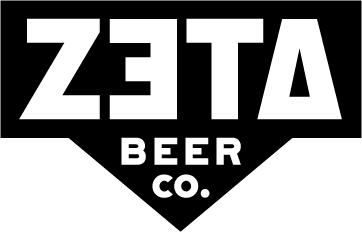
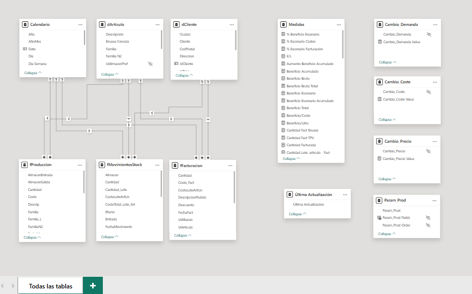

# 🍺 ZetaBeer Analytics

>**End-to-end business intelligence project for a craft brewery.** Real production data. Full supply chain visibility: from raw materials through fermentation, packaging, invoicing and inventory — with scenario simulation and revenue forecasting.

> ⚠️ This is a client project. The repository contains no source data or proprietary information.

---

## 🎯 Project Overview

This is a Power BI project designed for ZetaBeer management team.
It centralises three core business areas — sales, production and stock — into a single
analytical layer, enabling strategic decision-making through KPI monitoring, cost analysis
and interactive forecasting.

## Report structure

**13 report pages** cover every angle of the business:

| Page | What you see |
|---|---|
| Detalle | Full billing breakdown by product family — revenue, margin, cost per litre |
| Facturación | Revenue trends and YoY evolution |
| Ventas Mensual | Monthly sales by year, seasonal patterns |
| Producción Detalle | Batch yield table — Mosto → Fermented → Granel → Envasado → Waste % |
| Producción Mensual | Monthly production volumes by family |
| Clientes | Top 10 clients, billing by country, per-client drill-down |
| Costes Producción | Cost breakdown: packaging, fabrication, hops, malt, yeast |
| Envases | Units sold by container type and year |
| Stock | Real-time stock valuation by warehouse (Principal, Mosto, Fermentado, Granel) |
| Stock Mensual | Monthly stock evolution with value trend |
| Escenarios | What-if simulation: change price, demand, and cost simultaneously |
| Previsión | Revenue and margin forecast using scenario parameters |

---

## 🏗️ Model Architecture

**Type:** Star schema — 3 fact tables, 2 shared dimensions, 1 DAX calendar
**Storage mode:** Import
**Format:** `.pbip` — TMDL folder structure, fully versionable in Git
**Culture** `es-ES`

### Tables

| Table | Type | Description |
|-------|------|-------------|
| `fFacturacion` | Fact | Customer billing lines — enriched with unit cost per Batch-Item key |
| `fProduccion` | Fact | Production operation lines (wort, fermentation, bulk, bottling, transfers) |
| `fMovimientosStock` | Fact | Warehouse movement history — excludes internal SGA movements |
| `dArticulo` | Dimension | Product master with family hierarchy and packaging attributes |
| `dCliente` | Dimension | Customer master (parent-level) |
| `dCalendario` | Dimension | DAX calendar via `CALENDAR(StartDate, EndDate)` dynamically updated with fFacturacion, es-ES locale |
---

## 🔧 ETL — Power Query

Source: 
**SQL Server** (parametrised connection via `p_servidor` / `p_base`).

| Query | Folder | Description |
|-------|------|-------------|
| fFacturacion |Hechos|JOIN Facturas_Cli_Cab + Pedidos_Cli_Lineas + LineasUbic. Enriched with unit cost per Lot-Item.
|fProduccion|Hechos|View vPers_Producciones_Lineas. Batch standardization, calculated cost columns and liters.
|fMovimientosStock|Hechos|JOIN Articulos_Stock + Almacen_Hist_Mov. Filtered by almacén e IdMovimiento. Included  Lote-Art.
|dArticulo|Dimensiones|JOIN Articulos + Articulos_Familias. Calculated column Envase Cerveza and Litros/Envase.
|dCliente|Dimensiones|Vista VClientes_Padres. 
|Coste_Un_Lote_Art|Auxiliares|Calculate unit cost per Lot-Item. Base of cost merges in fFacturacion and fMovimientosStock.
|Lote-Familia|Auxiliares|Lot → Family correspondence table. Used in fProduction to enrich with the lot family.
|ConexionZetadbo|Conexiones|SQL connection object built with p_servidor y p_base.

Key transformations:

- **Lote-Art key** Composite key shared by three fact tables (`Lote + '-' + IdArticulo`). This key enables cost traceability from production batch through to the invoice line — a critical link for margin analysis at the individual product level.
- **Cost logic in fProduccion**: operations 5/6 (store transfers) forced to zero; only `TipoLinea = Consumo` and `N2Familia = MATERIAS PRIMAS` are costed
- **Litros Previstos / Litros Envasados**: derived from specific operation codes (1 = Mosto, 4 = Envasado) — necessary to compute yield and waste %
- **CosteLoteArtUn in fFacturacion**: LeftOuter merge against an auxiliary cost query, giving per-unit batch cost at invoice time
- **Envase Cerveza / Litros per Envase in dArticulo**: normalises container descriptions and maps standard sizes (30L keg → 30, 0.33L bottle → 0.33) for volume calculations
- **Lote normalisation**: uppercase, code extraction, `L` prefix, plus manual corrections for historical batch ID errors

Filters applied:
- `fMovimientosStock`: excludes warehouses 5–6 (non-inventoriable / own stores)
- `fMovimientosStock`: excludes internal SGA movements 41–48

---

## ⚙️ DAX Measures
82 measures across 10 folders

| Folder | Examples |
|---|---|
| Facturación | Total revenue, revenue per litre, YoY % |
| Cantidades | Total litres, units by container |
| Costes | Total cost, cost per litre by material group |
| Beneficio | Gross profit, gross margin %, profit per litre |
| Producción | Yield %, waste %, litres by production stage |
| Stock | Stock value, weighted average unit cost |
| Ratios | Billing ratio by family, cost ratio by group |
| Escenario\Facturación | Scenario revenue (price × demand What-If) |
| Escenario\Coste | Scenario cost (cost What-If) |
| Previsión | Forward-looking revenue, margin, cost projection |

####

**Key DAX patterns used:**
- `SUMX` (Iteration) Required when the unit cost varies by Batch-Item.
- `CALCULATE + REMOVEFILTERS`, `DATEADD` time intelligence.
- `CALCULATE + ALL`
Removes family filters to obtain base totals in scenarios.

- `CALCULATE + ALLSELECTED`
Maintains user filters but removes the family filter.
- `SELECTEDVALUE` for What-If parameter extraction
- `CALENDAR` for the time dimension
- `USERELATIONSHIP` to activate alternate date relationships on production dates
- `TREATAS`
Quantity Batch-Item. Cross-references fProduccion con fFacturacion.
- `ISINSCOPE`
Returns a value only when there is a single Batch Item in the granularity context.

- `EOMONTH`
Monthly Accumulated Stock, Monthly Accumulated Stock Value. Calculates the balance on the last day of the month.

- `NAMEOF`
Production Parameter. Reference to measures by name for the dynamic production stage selector.

---

## 🎛️ What-If Scenario Simulation

Three interactive parameters allow real-time simulation of strategic variables
**without modifying historical ERP data:**

| Parameter | Range | Effect |
|-----------|-------|--------|
| `Cambio_Precio` | -35% → +35% | Multiplies unit price in scenario measures |
| `Cambio_Demanda` | -35% → +35% | Multiplies quantity in revenue and cost scenarios |
| `Cambio_Coste` | -35% → +35% | Multiplies production cost in cost scenario |

All three slicers combine simultaneously — the result is reflected in
`Beneficio Escenario` and `Previsión Beneficio Escenario`.

---

## 🔒 Row Level Security (RLS)

**Current status**: 

RLS is not implemented in the current version of the model.
The model is for individual/small team use with unrestricted access by user profile.
If multiple users access is needed in the future then will be consider implementing RLS by department (management, production, administration).

---

## 🛠️ Tech Stack

---

## 📫 Contact

> ⚠️ **Note:** The `.pbix`/`.pbip` file is not included in this repository. Data and connection details are confidential. Screenshots are anonymised.
